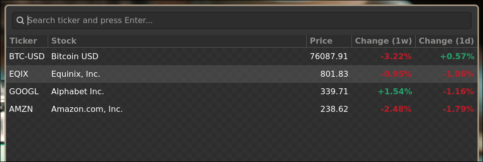
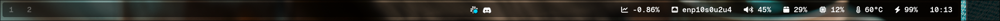

# Stockfin

A GTK app for tracking stocks and crypto using the Yahoo Finance open API. No credentials required.



## Installation

### Cargo

```bash
cargo install stockfin
```

### Nix Flake

```bash
nix run github:jlodenius/stockfin
```

### System Dependencies

Requires the following system libraries:

- gtk4
- glib
- dbus
- pkg-config (build only)

## Waybar Integration



Add the following snippets to your Waybar configuration to integrate the Stockfin D-Bus service.

## 1. Module Definition
Add this to your `waybar/modules.json`. This module polls the D-Bus service every 30 seconds and handles the window activation on click.

```json
{
  "custom/stockfin": {
    "format": " {}",
    "return-type": "json",
    "interval": 30,
    "exec": "busctl --user get-property org.jlodenius.stockfin.Waybar /org/jlodenius/stockfin org.jlodenius.stockfin StatusJson | sed 's/s \"//;s/\"$//;s/\\\\//g'",
    "on-click": "busctl --user call org.jlodenius.stockfin.Waybar /org/jlodenius/stockfin org.jlodenius.stockfin Activate",
    "escape": true
  }
}
```


## 2. Optional styling
Add these classes to `waybar/style.css` to enable dynamic colouring.

The colour is calculated by taking the daily price change of every tracked stock in your portfolio and computing their collective average to determine the overall market sentiment.

```css
/* Applied when the average daily delta of all tracked stocks is above +5% */
#custom-stockfin.bullish {
  color: #a6e3a1;
}

/* Applied when the average daily delta of all tracked stocks is below -5% */
#custom-stockfin.bearish {
  color: #ff5555;
}
```
